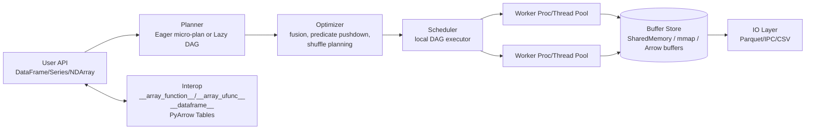
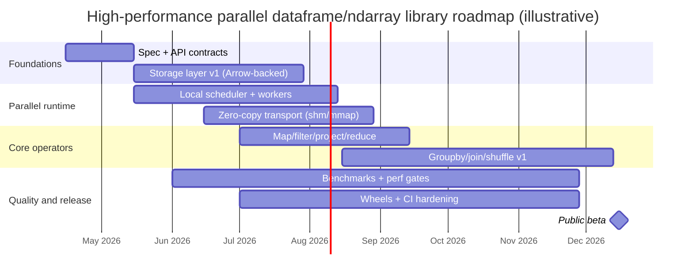

# Building a High-Performance Python Library with Multiprocessing That Combines Pandas and NumPy Semantics

## Executive summary

Building a high-performance “parallel Pandas + NumPy” library is less about “adding multiprocessing” and more about **choosing a memory model + execution model** that minimize copying, allow predictable semantics, and keep Python overhead off the critical path. The strongest pattern across successful systems is: **partitioned, columnar data + an execution plan (task graph) + a runtime that can move references instead of bytes**. Dask explicitly frames this as “blocked algorithms + dynamic, memory-aware scheduling” to extend NumPy/Pandas-style computing to larger-than-memory datasets. 

A realistic library must reconcile three tensions:

First, **dataframe semantics are surprisingly ambiguous**, and “drop-in Pandas compatibility” becomes a long-tail engineering project. The Modin team highlights both performance limitations of dataframes on moderate-to-large datasets and the “significant ambiguity regarding dataframe semantics,” which complicates compatibility and optimization. 

Second, **Python parallelism is constrained by the GIL and by data movement costs**. NumPy can scale with threads for many low-level operations because “many NumPy operations release the GIL,” but object-heavy workloads (e.g., `dtype=object`) may not release the GIL and can favor multiprocessing. 

Third, in modern Python, **safe multiprocessing requires careful process start methods and serialization choices**. CPython’s `multiprocessing` documentation emphasizes that `spawn`/`forkserver` require picklable objects and warns against sending shared objects via pipes/queues; and in Python 3.14, POSIX defaults changed from `fork` to `forkserver` to avoid common multithreaded incompatibilities. 

Recommended direction (practical, high impact): adopt an **Arrow-centered columnar storage** (for zero-copy possibilities and cross-library interchange) and offer a **pluggable execution backend**:

- A **local “single-machine” backend**: process pool + shared memory and/or memory-mapped buffers (fastest path to a usable product; easiest to ship).
- Optional integration backends:
 - **Dask** for task-graph scheduling and distributed clusters.  
 - **Ray** for an object-store-based runtime with “zero-copy deserialization” for NumPy arrays via Plasma on the same node. 

This report lays out: concrete goals/use-cases; API design trade-offs (Pandas-like + NumPy-like interop, eager vs lazy); concurrency and memory models (shared memory, mmap, Arrow, serialization); partitioning/sharding; scheduling and fault tolerance; optimization strategies; ecosystem integration; and an implementation roadmap with benchmarks and packaging guidance.

## Goals and use cases

A “parallel Pandas+NumPy” library should be explicit about **where it is better than Pandas/NumPy alone** and where it competes with existing systems (Dask/Modin/Ray/Vaex/Polars/cuDF). The best way to avoid becoming “yet another parallel dataframe” is to define crisp workload targets.

**Data sizes (design envelope).** A useful product typically spans three regimes (these are design targets, not hard limits):

- In-memory analytic tables: ~100MB to ~30–100GB on a single machine (bounded by RAM and memory bandwidth).
- Out-of-core / memory-mapped workflows: datasets larger than RAM, where operations must stream, filter, or aggregate without full materialization (Vaex is an existence proof here, leaning on memory mapping and lazy computation).  
- “Distributed scale-out” (optional): multi-node datasets (100GB–TB+) where the runtime’s network/object-store costs dominate; Spark/Ray/Dask patterns apply (and “pandas API on Spark” exists specifically because “pandas does not scale out to big data”). 

**Workload classes.**

ETL and feature engineering: read Parquet/CSV/IPC, filter, derive columns, join dimension tables, groupby aggregates, write back. Arrow’s ecosystem is directly relevant because it provides a columnar format and IPC/serialization plus compute functions (`pyarrow.compute`) for common operations. 

Analytics: groupby, window/rolling, joins, sorts, top-k, pivot-like transforms, and summary statistics. Data-level parallelism depends heavily on the ability to **partition and shuffle** efficiently; Dask’s documentation calls out shuffling and repartitioning as explicit primitives (e.g., `shuffle`, `set_index`) because many analytics require global redistribution. 

ML preprocessing: large numeric arrays/tensors, categorical encoding, missing-value handling, scaling, and train/validation splits. This straddles dataframe semantics and ndarray semantics and is often bottlenecked by either (a) per-row Python work or (b) large array transforms. For the latter, NumPy threading can work well because many operations release the GIL. 

**Non-functional goals.**

Predictable semantics under mutation: Pandas 3.0 makes Copy-on-Write the default, aiming for more predictable behavior and fewer accidental shared-memory side effects. A new library should either align with these expectations or clearly diverge. 

Interoperability as a first-class feature: implement the protocols that the ecosystem is converging on:
- NumPy dispatch and memory sharing protocols (`__array_ufunc__`, `__array_function__`, array interface).  
- DataFrame interchange protocol (`__dataframe__`) for dataframe handoff across libraries. 

Security posture that treats deserialization as a trust boundary: `pickle` is explicitly “not secure” and can execute arbitrary code during unpickling. 

## Comparative landscape of existing projects

The table below focuses on systems that already deliver either (a) Pandas-like parallelism, (b) NumPy-like blocked parallel arrays, or (c) the underlying memory/runtime mechanisms that matter for a new design.

| Project | Core abstraction | Execution model | Parallelism & data movement | Strengths for your goal | Key limitations / risks | Maturity signal | License |
|---|---|---|---|---|---|---|---|
| Pandas | `DataFrame` / `Series` | Mostly eager; Copy-on-Write default in 3.0 | Single-process; performance depends on vectorization; CoW delays copies | Canonical semantics; huge ecosystem; CoW reduces accidental side effects | Not a multiprocessing engine; complex semantics become “compatibility tax” for reimplementations  | Widely used; active docs (3.0.2 dated Mar 30, 2026)  | BSD-3  |
| NumPy | `ndarray` | Eager | Threads can scale for many ops because “many NumPy operations release the GIL”; object dtype may not and can favor multiprocessing  | Defines ndarray semantics; protocols for dispatch/interop | ndarray broadcasting + partitioning across processes is tricky; shared mutation is unsafe without discipline  | Core SciPy stack | BSD-3  |
| Dask (Array/DataFrame/Distributed) | Dask collections that mimic NumPy/Pandas | Lazy task graphs | Multiple schedulers (threads/processes/distributed); encodes algorithms as task graphs; distributed scheduler is centrally managed, async/event-driven  | Proven blocked algorithms + task scheduling approach; good baseline for “ndarray + dataframe” parallel semantics | Overheads: graph construction, scheduling; semantics are a large subset, not full Pandas; shuffles expensive  | Mature; frequent releases (e.g., 2026.3.0 shown)  | BSD-3  |
| Modin | Pandas API layer | Mostly eager from user POV | Distributes Pandas-like ops over Ray/Dask/Unidist; partitions both rows and columns for scalability  | Best “drop-in Pandas” experience (import swap); strong reference architecture for compatibility layering  | Compatibility and performance vary by operation; needs backend runtime; dataframe semantics ambiguity is fundamental  | Active docs; multiple engines | Apache-2.0 (plus BSD-3 for forked Pandas parts)  |
| Ray Data / Ray Core | `Dataset` of Arrow “Blocks” + object store | Planned execution + streaming | `Dataset` produces `ObjectRef[Block]` where blocks hold data in Arrow format and define unit of parallelism; Ray uses Plasma; NumPy arrays are shared on-node with zero-copy deserialization  | Strong substrate for “shared-memory-like” object passing across processes; good for pipelines | Ray operational footprint; API is not Pandas-first; semantics differ; cluster-first design | Mature; OSDI’18 design paper; active docs  | Apache-2.0  |
| Vaex | Out-of-core `DataFrame` | Lazy expressions | Uses memory mapping, “zero memory copy policy,” lazy computations; targets huge tabular data on a single machine  | Excellent reference for out-of-core + lazy columnar semantics; strong on big-file exploration | Not a general-purpose task scheduler; less aligned with full Pandas semantics | Established project | MIT  |
| Polars | `DataFrame` + expression engine | Eager + lazy (`collect`) | Built to use all cores via multithreading; lazy engine can optimize plans; multiprocessing often *not* helpful for Polars itself because it is already threaded  | Best-in-class single-node performance patterns; strong “lazy plan” API reference | Not multiprocessing-based by default; semantics differ from Pandas; integrating Pandas drop-in is nontrivial | Very active; frequent releases  | MIT  |
| cuDF (RAPIDS) | GPU `DataFrame` (pandas-like) | Eager (GPU kernels) | Built on Arrow columnar memory format; focuses on GPU acceleration  | Demonstrates Arrow-first columnar design + DataFrame semantics | Requires NVIDIA GPUs; different performance envelope than CPU multiprocessing | Mature in GPU ecosystem | Apache-2.0  |
| Pandas API on Spark | Pandas-like API on Spark | Lazy/optimized Spark plans | Runs on Spark execution graphs; positioned as scaling Pandas to big data  | Shows what “Pandas semantics over an engine” looks like at scale | Requires Spark; differences vs Pandas and performance surprises | Mature via Spark | Apache-2.0 (Spark)  |

**What these projects imply for a new library design.**

A new “multiprocessing Pandas+NumPy” library is unlikely to beat Polars on single-node OLAP-style queries, or Spark on cluster ETL, or cuDF on GPU analytics. The viable niche is:

- **A tight, Python-native library** that makes *local multiprocessing* efficient by **reducing serialization and copying**, and
- **A compatibility-minded API** that can present both dataframe and ndarray semantics while still interoperating with Pandas/NumPy/Arrow protocols.

The Modin paper is the clearest warning: dataframe systems suffer from semantic ambiguity, so you want an architecture where **semantic compatibility is a layer**, not baked into every internal optimization. 

## API design for Pandas and NumPy semantics

The API is the product. Runtime choices are only worthwhile if surfaced through an ergonomic, unsurprising interface.

**Core user-facing objects.** A pragmatic starting set:

- `DataFrame`, `Series`, `Index` with Pandas-like method names and return types (or close analogs).
- `Array` / `NDArray` with NumPy-like semantics for N-dimensional data, at least for contiguous numeric dtypes.
- Interop surface: `.to_pandas()`, `.to_numpy()`, `.to_arrow()`, plus constructors `from_pandas`, `from_numpy`, `from_arrow`.

**Interoperability contracts to implement early.**

NumPy dispatch protocols:
- `__array_ufunc__` (NEP 13): lets arrays override ufunc behavior.  
- `__array_function__` (NEP 18): dispatch for high-level NumPy functions that would otherwise coerce to `ndarray`.  
- Array interface protocol: a mechanism for sharing N-dimensional array memory metadata and buffer pointers. 

Dataframe interchange:
- `__dataframe__` protocol (Consortium for Python Data API Standards) enables data interchange “between dataframe libraries,” supporting missing data and chunking/batches.  
- Pandas has `pandas.api.interchange.from_dataframe(..., allow_copy=...)` and explicitly frames `allow_copy=False` as requesting a zero-copy approach (with version caveats). 

Arrow interop:
- Converting between NumPy arrays and Arrow arrays is a documented path in PyArrow.  
- Arrow’s C Data Interface is “zero-copy by design” for in-process exchange.  
- Arrow IPC reading can be zero-copy when the input supports zero-copy reads (e.g., memory map). 

**Eager vs lazy execution: a recommended stance.**

You likely need *both*:

- **Default eager mode** for Pandas-like ergonomics and debuggability.
- **Optional lazy mode** to fuse operations, minimize passes over data, and plan shuffles and IO. Polars is explicit that lazy queries are only evaluated on `collect()`, and that deferring execution can yield “significant performance advantages.”  
- Internally, even “eager” APIs can construct micro-plans and execute them immediately; the key is allowing fusion and avoiding intermediate materializations.

A clean user model is:

- `df = plib.read_parquet(...)` returns an eager `DataFrame`.
- `df.lazy()` returns a `LazyFrame` / `Query` object (plan builder).
- `df.compute()` blocks and returns results (if lazy), similar in spirit to `.collect()` in Polars or `.compute()` in Dask collections.

**User ergonomics for parallelism configuration.**

Modin popularized “change one line of code” (replace `import pandas as pd` with `import modin.pandas as pd`) and uses Ray/Dask/Unidist engines under the hood.  A new library can emulate this *without pretending* to be a perfect drop-in:

- Global configuration: `plib.set_backend("process")`, `plib.set_backend("ray")`, etc.
- Context manager: `with plib.backend(processes=8, shared_memory=True): ...`
- Explicit per-operation overrides: `df.groupby(..., engine="threads")` for numeric-only cases.

**Sample API sketches and code examples.**

Example: mixed Pandas-like and NumPy-like semantics with an optional lazy plan.

```python
import plib as pl # hypothetical library

# Eager DataFrame, Arrow-backed internally
df = pl.read_parquet("events.parquet")

# Pandas-like transforms
df2 = (
 df[df["event_type"].isin(["click", "view"])]
 .assign(hour=lambda x: x["ts"].dt.floor("h"))
 .groupby(["user_id", "hour"])
 .agg(count=("event_id", "count"),
 revenue=("amount", "sum"))
)

# Convert outputs
pdf = df2.to_pandas() # pandas.DataFrame
tbl = df2.to_arrow() # pyarrow.Table
```

Arrow-based interoperability is strategic because Arrow’s format is designed for efficient analytic operations and supports zero-copy reads/interop in multiple ways. 

Example: NumPy ufunc interop via NEP 13/18 surface area.

```python
import numpy as np
import plib as pl

x = pl.arange(0, 10_000_000, dtype="float64", chunks=1_000_000) # chunked NDArray
y = np.sin(x) + 0.1 * x # dispatch via __array_ufunc__ / __array_function__

result = y.sum().compute() # executes parallel reduction
```

If you implement `__array_function__`/`__array_ufunc__`, you can intercept `np.sin`, `np.sum`, etc., rather than being coerced into a plain `ndarray`. 

Example: dataframe interchange protocol for “bring your own dataframe.”

```python
import pandas as pd
import plib as pl

pdf = pd.DataFrame({"a": [1, 2, 3], "b": [10, 20, 30]})
df = pl.from_pandas(pdf)

# Or: accept any object implementing __dataframe__()
df2 = pl.from_dataframe(pdf.__dataframe__())
```

The `__dataframe__` protocol is explicitly aimed at dataframe interchange and supports chunking/batches and missing data semantics. 

## Parallel runtime design

This section maps directly to the engineering dimensions you requested: concurrency model, partitioning/sharding, serialization, scheduling/task graphs, fault tolerance/reproducibility, and performance optimization.

**Concurrency model: threads vs processes vs shared memory.**

Threads: For numeric-heavy paths, threads can be very effective because NumPy releases the GIL for many low-level operations, enabling true parallel execution in those regions. NumPy’s thread-safety guidance explicitly states that “many NumPy operations release the GIL” and notes that `dtype=np.object_` operations commonly do not, and may be better served with multiprocessing. 

Processes: Use multiprocessing for:
- Python-object-heavy operations (`apply` with Python callables, string/object columns, custom UDFs).
- Isolation when native libraries have complicated thread interactions.
- Large fan-out task graphs where per-task GIL contention would dominate.

Process start methods and safety: CPython documents that with `spawn`/`forkserver`, many objects must be picklable, and warns to avoid sending shared objects by pipes/queues. In Python 3.14 on POSIX, the default start method changing from `fork` to `forkserver` is a big compatibility factor for modern Python deployments. 

Shared memory: `multiprocessing.shared_memory` provides a `SharedMemory` class for direct access across processes (added in 3.8) and a `SharedMemoryManager` for lifecycle management. 

Memory mapping: `numpy.memmap` supports mapping on-disk arrays to memory without reading the full file into RAM—useful for out-of-core and for sharing read-only data across worker processes via the OS page cache. 

A practical pattern, validated in the ecosystem: joblib/loky + memmap. Scikit-learn documents that when doing multiprocessing, “in order to avoid duplicating the memory in each process … joblib will create a memmap that all processes can share” above a size threshold.  Loky itself aims to provide a robust cross-platform `ProcessPoolExecutor` and emphasizes crash handling and safer process behavior. 

**Zero-copy and IPC: when references beat serialization.**

Arrow memory model: Arrow defines a language-independent columnar memory format and emphasizes zero-copy reads to reduce serialization overhead. 

In-process exchange: Arrow C Data Interface is “zero-copy by design” with a minimal C definition and explicit lifetime management. 

Cross-process exchange: Arrow IPC (stream/file) can be zero-copy on reads when the input supports zero-copy reads (e.g., memory map). 

Ray’s approach is instructive: Ray uses Plasma; “NumPy arrays in the object store are shared between workers on the same node (zero-copy deserialization).”  If you don’t want Ray as a dependency, you can still copy the *idea*: one object store per node, buffers in shared memory, and tasks passing small references.

**Serialization formats: pickle, cloudpickle, Arrow IPC, shared buffers.**

Pickle: is ubiquitous but unsafe for untrusted inputs; Python explicitly warns that `pickle` “is not secure” and can execute arbitrary code when loading data. 

Pickle protocol 5 (PEP 574): adds out-of-band buffers so large data can be handled as “zero-copy buffers,” letting applications manage big payloads separately from the pickle opcode stream.  This is highly relevant if you want a Python-native message format while transporting large column buffers efficiently.

Cloudpickle: valuable for serializing dynamically defined functions/classes in distributed computing; it can serialize functions/classes “by value,” unlike `pickle`’s module-reference constraints. 

Dask’s approach: Dask distributed uses serializers `['dask', 'pickle']` by default and falls back to pickle/cloudpickle; it explicitly mentions this configurability can matter for users “sensitive about receiving Pickle-serialized data for security reasons.”  This is a strong precedent for offering configurable serialization families in your library.

Arrow IPC: best when you want cross-language, schema-aware, columnar serialization; it also composes cleanly with memory maps for zero-copy reads. 

**Data partitioning and sharding strategies.**

Partitioning defines your unit of parallelism, memory locality, and shuffle complexity.

Row-wise partitions: Dask DataFrame is “comprised of many in-memory pandas DataFrames separated along the index” (blocked parallelism).  This is the simplest way to reuse Pandas semantics within each partition, but can induce overhead and makes columnar optimizations harder.

Row+column partitions: Modin explicitly chose a schema that partitions along both columns and rows to get flexibility/scalability in both directions, and documents partitions as a core abstraction.  This is powerful but increases complexity for operations that need global row/column ordering semantics or consistent index behavior.

Columnar “record batch” partitions: Ray Data documents that blocks hold data in Arrow format, represent shards of the dataset, and “determine the unit of parallelism.”  This is attractive if your internal representation is Arrow (or Arrow-compatible), because you can shard by row batches but keep columnar buffers.

Out-of-core partitions: Vaex couples memory mapping + lazy computations + a “zero memory copy policy,” emphasizing operating on data without loading it all. 

**Recommended sharding rules of thumb (single-node).**

- Default shard by rows into **N partitions ≈ 4–16× CPU cores** for ETL/analytics, but cap partition count to avoid scheduler overhead (the exact number is workload dependent).
- Choose partition byte sizes so that (a) they fit L3 cache poorly anyway (so you’re memory bandwidth bound) but (b) they amortize task overhead; many systems target tens to hundreds of MB per partition for scan-heavy workloads, smaller for expensive operations.
- Separate “logical index semantics” from “physical partitioning.” You can keep a logical Pandas-like `Index` while physically storing row batches.

**Scheduling and task graph execution.**

A high-performance parallel library needs a scheduler that can handle:

- per-task overhead,
- data dependencies,
- backpressure (to avoid OOM),
- and (optionally) retries.

Dask’s conceptual model is explicit: it “encodes algorithms as task graphs” (often dictionaries) and provides schedulers over that graph.  Dask distributed adds a centralized scheduler coordinating multiple workers and describes itself as a “centrally managed, distributed, dynamic task scheduler” with asynchronous, event-driven scheduling. 

Ray Data similarly exposes that a `Dataset` is built on an `ExecutionPlan` and yields `ObjectRef[Block]`, making blocks the unit of parallelism and planning. 

For your library, two viable scheduling tiers exist:

- **Tier one (MVP):** a local scheduler that executes a task DAG using a `ProcessPoolExecutor`-like interface, with manual control of partitioning and data placement.
- **Tier two (advanced):** a distributed scheduler or integration with Dask/Ray rather than rebuilding that complexity.

**Fault tolerance and reproducibility.**

Fault tolerance is mostly a property of the runtime. Dask distributed has explicit documentation on resilience and notes that scattered data not present in the scheduler may be “irreparable” if a worker holding it dies, and suggests replication or backing data onto resilient storage. 

Ray’s system design paper emphasizes a distributed scheduler and a “fault-tolerant store to manage the system’s control state.” 

For a single-node multiprocessing library, “fault tolerance” usually means:
- detect worker crashes,
- restart workers,
- recompute lost partitions from lineage (task graph),
- and avoid corrupting shared memory state.

Reproducibility is threatened by data races and nondeterminism. NumPy’s thread-safety guidance warns that simultaneous read/write on shared arrays can yield “inconsistent, racey results that are not reproducible.”  For ML pipelines, deterministic behavior also depends on controlling randomness; PyTorch explicitly warns that deterministic operations can be slower and documents seed control and other sources of nondeterminism. 

**Performance optimization toolbox: vectorization, native kernels, memory layout.**

Vectorization and avoiding Python loops remains the highest ROI tactic. Your runtime should encourage operations that lower to native code, because that’s where you avoid GIL limitations (threads) and reduce per-task Python overhead.

Native kernels:
- Cython can run code without the GIL via `nogil` blocks, letting CPU-bound loops execute in parallel threads when they do not touch Python objects.  
- Numba can automatically parallelize some operations with `parallel=True` in `jit()`.  
- Arrow compute provides prebuilt kernels in `pyarrow.compute` that operate on Arrow arrays and tables. 

Memory layout and cache locality:
- Arrow’s columnar format is explicitly organized for efficient analytic operations on CPUs/GPUs.  
- For ndarray semantics, respecting contiguous layouts and minimizing strided/non-contiguous copies is critical; NumPy’s array interface protocol exists for buffer sharing and metadata. 

## Architecture options and implementation roadmap

### Recommended architecture options with trade-offs

Below are three architecture paths that cover most realistic strategies.

| Option | Core idea | Pros | Cons | Best fit |
|---|---|---|---|---|
| Local engine + Arrow buffers | Build your own local task graph executor; store partitions as Arrow RecordBatches / arrays; use shared memory / mmap for buffers | Smallest dependency footprint; can be extremely fast on one machine; you control semantics | You must build scheduling, spilling, retries; hard to match Dask/Ray maturity | Teams optimizing single-node multiprocessing + zero-copy |
| Dask-native backend | Implement your `DataFrame`/`NDArray` as a thin layer over Dask graphs/collections, or compile to Dask graphs | Proven task graph model and schedulers (threads/processes/distributed); strong community baseline  | Semantics constrained by Dask; overhead of Dask graphs and shuffles; dependency weight | Users who already run Dask locally or on clusters |
| Ray-native backend | Represent partitions as Arrow blocks in Ray object store; execute with Ray tasks/actors; leverage zero-copy NumPy in Plasma | Strong “reference passing” story; Ray docs explicitly claim zero-copy deserialization of NumPy arrays on-node  | Operational footprint; different user expectations than Pandas; needing Ray cluster mgmt | Pipeline workloads + multi-process + future multi-node |

A hybrid design—**Arrow-first storage with a backend interface**—is often the most future-proof. It lets you start with a local engine and later map your task graph onto Dask or Ray.

### Reference architecture diagram



This architecture is motivated by patterns seen in: Dask’s blocked algorithms + task scheduling model , Ray’s Arrow-block unit of parallelism , and Arrow’s zero-copy design for in-memory interchange. 

### Concrete implementation roadmap with milestones, effort, and skills

Effort estimates below assume a small team (2–5 engineers) working in parallel; numbers are approximate because Pandas-compatibility scope can expand rapidly (as Modin’s experience and the dataframe semantics literature indicate). 

| Milestone | Deliverables | Estimated effort | Required skills |
|---|---|---:|---|
| Product definition and API contracts | Decide: drop-in vs “Pandas-like”; define supported ops; define mutation/CoW semantics; define interchange + NumPy protocol support | 3–6 person-weeks | Pandas/NumPy expertise; API design |
| Storage layer v1 | Arrow-backed column store; chunked partitions; schema/dtype system; conversions to/from Pandas/NumPy/Arrow | 6–12 person-weeks | PyArrow internals, dtype systems, memory management |
| Local execution engine v1 | Task DAG representation; local scheduler; process pool; partition-aware operators (`map`, `filter`, `project`, `reduce`) | 8–16 person-weeks | Concurrency, multiprocessing patterns, performance engineering |
| Zero-copy transport | SharedMemory + buffer registry; mmap dataset option; Arrow IPC for persistence; pickle protocol 5 for OOB buffers | 6–12 person-weeks | OS memory, IPC, Python serialization (PEP 574)  |
| Operator suite expansion | groupby/agg, join/merge, sort/shuffle, window ops; vectorized kernels via Arrow compute and/or Numba/Cython | 12–30 person-weeks | Algorithms, Arrow compute , Cython/Numba  |
| Fault handling + reproducibility | Worker crash detection; recomputation; deterministic partitioning rules; seed management hooks; “no shared mutation by default” | 6–14 person-weeks | Systems reliability, determinism discipline; Dask/Ray experience helpful  |
| Backend plugins (optional) | Dask backend compiler / Ray backend compiler | 8–20 person-weeks per backend | Dask graphs/serialization ; Ray object store  |
| Packaging + release engineering | Wheels (Linux/macOS/Windows), CI, ABI policy, benchmark CI, docs | 4–10 person-weeks (ongoing) | Packaging, C-extensions, CI/cibuildwheel  |

Timeline sketch (1-year plan, overlapping tracks):



These phases are justified by the need to (a) settle semantics early (Pandas/Modin experience),  (b) prioritize data movement/zero-copy first (Arrow design goals),  and (c) treat scheduling as a first-order feature (Dask model). 

## Benchmarking, packaging, and governance

### Testing and benchmarking methodology

**Benchmark tooling.** Use the same tools the ecosystem uses:

- Airspeed Velocity (asv) to track performance over time; Pandas runs benchmarks in `asv_bench` using asv, and NumPy documents benchmarking with asv.  
- Pyperf for robust microbenchmarks and metadata capture; pyperf provides options for reproducible benchmark results and metadata collection.  
- Pytest for correctness, with parametrization to systematically test dtype/shape/partition variants. 

**Benchmark metrics.** Track at least:
- Throughput: rows/s, bytes/s, partitions/s.
- Latency: end-to-end wall time, per-operation latency.
- Scaling: speedup vs cores, efficiency curve.
- Memory: peak RSS, temporary allocations, serialization overhead.
- Serialization: time and bytes copied vs referenced.
- Shuffle cost: bytes moved, partitions shuffled, spill-to-disk incidence.

**Representative microbenchmarks (diagnose the runtime).**
- Shared memory round-trip: publish a large numeric buffer and have workers read without copying (baseline against `pickle` and protocol 5 OOB).
- Serialization shootout: `pickle` vs `pickle protocol 5 + out-of-band` vs Arrow IPC stream for a set of buffers/schemas. (PEP 574 exists specifically for handling large data as separate zero-copy buffers.) 
- Task overhead: empty task execution cost, DAG scheduling overhead per node (critical for graph-heavy plans).
- Partitioned ufunc: `sin`, `log`, `add`, `where` on chunked arrays; compare thread backend vs process backend, noting NumPy’s behavior with GIL release and object dtype non-release. 

**Representative macrobenchmarks (user-visible workloads).**
- ETL pipeline: read Parquet → filter → derive columns → groupby aggregate → write Parquet/IPC.
- Analytics: join fact table with dimension table (hash join) + groupby + top-k.
- ML preprocessing: categorical encoding + scaling + train-test split; measure total time + memory overhead.

**Datasets.**
- Public “big table” datasets (NYC taxi, public clickstream samples, etc.).
- Synthetic schema-driven datasets for controlled scaling (cardinality, skew).
- Optional industry-standard analytic benchmarks (TPC-H-style queries). (If you publish results, be careful with benchmark rules and licensing.)

**Visual suggestions for reporting.** Even if you don’t embed images directly, design your benchmark output to generate:
- Speedup curves (cores vs throughput) for numeric and object-heavy workloads.
- Waterfall charts showing time split: IO, serialization, compute, shuffle.
- Memory timeline (peak RSS) during shuffles and joins.

### Packaging and deployment

If you ship performance, you will likely ship native code (C/C++/Rust/Cython) eventually. Plan packaging early.

- Use `pyproject.toml`; Python Packaging User Guide strongly recommends a `[build-system]` table to declare your build backend and build requirements.  
- Build wheels across platforms with cibuildwheel (manylinux/musllinux/macOS/Windows) and run tests against installed wheels; cibuildwheel explicitly supports bundling shared libraries and wheel testing.  
- For C/C++ extensions:
 - scikit-build-core is a PEP 517 backend using CMake with configuration in `pyproject.toml`.  
 - meson-python is a PEP 517 backend for Meson, well-suited for extension modules in C/C++/Cython/Fortran/Rust.  
- Be explicit about runtime dependencies like PyArrow; Arrow is Apache-2.0 and widely packaged on conda-forge, but wheel size and platform support matter.  
- If you support conda, align with conda-forge packaging practices (CI, skip selectors, ABI pinning).

### Security and licensing considerations

**Serialization security.** Treat deserialization as a high-risk surface:
- `pickle` can execute arbitrary code during unpickling and is “not secure,” so never accept pickled payloads from untrusted or unauthenticated sources.  
- If you integrate with Dask-like distributed execution, note that Dask defaults to serializers including pickle/cloudpickle, and explicitly calls out security concerns as a reason for serializer configuration.  
- Offer configurable serializers and document a “safe mode” (e.g., Arrow IPC only, no arbitrary Python object serialization).

**Shared memory lifecycle and DoS risks.** Shared memory segments are OS resources; leaks can degrade systems. Python provides `SharedMemoryManager` to assist lifecycle management across processes. 

**License selection.** Most adjacent projects are permissively licensed (BSD-3, Apache-2.0, MIT), which eases commercial and open-source adoption:
- Pandas and Dask: BSD-3.  
- Ray and Apache Arrow: Apache-2.0.  
- Polars and Vaex: MIT.  

If you copy code from Apache-2.0 projects, you must comply with NOTICE requirements; Apache provides guidance on LICENSE/NOTICE assembly.  
More broadly, GitHub’s licensing guidance explicitly recommends consulting a professional if you have legal questions. 

### Suggested libraries/tools to reuse and prioritized sources

**Highest-priority primary sources (official docs and original papers).**

- Dask design paper: “Blocked algorithms + dynamic scheduling” framing for parallel NumPy-like computation.  
- Ray system paper (OSDI’18): distributed scheduler + fault-tolerant store concepts.  
- Modin / dataframe systems paper: highlights semantic ambiguity and roadmap issues for dataframe engines.  
- Python multiprocessing and shared memory docs: start methods, picklability constraints, and shared memory primitives.  
- NumPy thread-safety + protocol docs: GIL release behavior, array interface, NEP 13/18.  
- Apache Arrow docs: columnar memory format, C Data Interface, IPC zero-copy behavior, compute functions.  
- Dataframe interchange protocol standard (`__dataframe__`): cross-library interchange contract.  
- Pickle protocol 5 (PEP 574): foundation for out-of-band zero-copy buffers in Python serialization.  
- Security warning for pickle (Python docs): explicit threat statement.  

**Reusable implementation building blocks (pragmatic).**
- Loky/joblib patterns for robust multiprocessing and memmap-based sharing (especially relevant for single-node).  
- PyArrow compute kernels and Arrow IPC as a high-performance alternative to Python-object-heavy execution.  
- Cython `nogil` for CPU kernels, Numba `parallel=True` for auto-parallelization.  
- asv + pyperf for performance regression tracking and stable microbenchmarks.  
- cibuildwheel + pyproject.toml build backends for cross-platform wheels. 

If you build toward this stack—Arrow-first storage, protocol-based interoperability, and a backend-pluggable runtime—you end up with a library that can start as an efficient single-machine multiprocessing engine and expand toward Dask/Ray integration without rewriting your core semantics or data model.