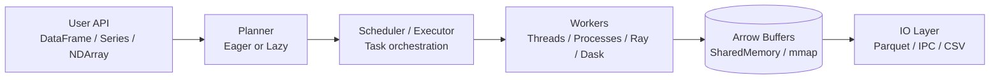

# Architecture

FrameX is structured as a layered local execution engine:

## Storage Model

- Core tabular storage is Arrow (`pyarrow.Table` / `RecordBatch`)
- DataFrame partitions are represented as `Partition` objects
- Columnar layout improves analytic scans and interoperability

## Execution Model

- Eager by default for Pandas-like ergonomics
- Lazy mode records operations in `LazyFrame` and executes with `collect()`
- Lazy operations currently execute as ordered transformations over the source frame

## Concurrency Model

FrameX provides multiple execution backends:

- threads for numeric paths that release the GIL
- processes for Python-heavy/object-heavy tasks
- Ray for local object-store-backed task execution
- Dask for task-graph execution and compatibility with Dask runtime tooling

`framex.runtime.executor.detect_backend(...)` and config controls determine backend behavior.

## Array Acceleration

`NDArray` ufunc execution supports configurable acceleration paths:

- `numpy` (default)
- `numexpr` for expression-heavy CPU kernels
- `numba` for JIT-assisted functions
- `cupy` for GPU-capable environments

These are selected via `set_array_backend(...)` or the `config(...)` context manager.

## Memory and Transport

- Arrow buffers are the primary in-memory representation
- shared memory and memory-mapped strategies are used for efficient transfer patterns
- serializer options are configurable (`arrow`, `pickle5`, `pickle`)

## Interchange and Compatibility

FrameX exposes compatibility as an interface layer:

- dataframe interchange via `__dataframe__`
- NumPy protocols via `__array_ufunc__` and `__array_function__`
- explicit conversion methods to Pandas/Arrow/Dask/Ray

This allows internal optimization without requiring full internal Pandas semantics at every layer.
