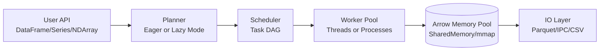

# FrameX Architecture Overview

FrameX is designed as a high-performance Python library for parallel dataframe and array processing. It provides both Pandas and NumPy semantics with a flexible execution and memory model built natively on Apache Arrow.

## Design Philosophy

The core design tension in parallel libraries is balancing Python-friendliness (Pandas/NumPy semantics) with performance (avoiding GIL contention, reducing serialization overhead, and minimizing memory copying).

FrameX approaches this via a clear layered architecture:

- **Storage**: Arrow-backed columnar format. This ensures zero-copy cross-library exchange and fast analytics.
- **Execution**: Eager-by-default execution (for Pandas ergonomics) with an opt-in Lazy mode (similar to Polars).
- **Concurrency**: A hybrid model utilizing threads for numeric arrays (which release the Python GIL) and processes for Python object-heavy string/dictionary operations.
- **Data Flow**: Leveraging shared memory, memory-mapped buffers, and Arrow IPC to pass references rather than copying raw byte streams between workers.

## Architectural Layers

### 1. User API (Core Data Structures)

The top level defines the objects developers interact with:
- `DataFrame`: A partitioned, Arrow-backed table. Eager by default. 
- `LazyFrame`: An opt-in lazy variant of `DataFrame` that collects operations as a DAG, executing them optimally upon calling `.collect()`.
- `Series`: A 1D column backed by `pyarrow.ChunkedArray`.
- `NDArray`: N-dimensional numeric arrays with chunk-based scaling designed for drop-in NumPy dispatch (`__array_ufunc__`, `__array_function__`).

### 2. Runtime and Executor (`framex.runtime`)

A smart worker pool executor wraps `ThreadPoolExecutor` and `ProcessPoolExecutor`. 
- **Auto-Backend Heuristic**: FrameX inspects the data schema before executing tasks. If the schema contains string, list, or struct types (which incur Python object overhead), the executor dispatches workloads to **Processes**. If it finds only numeric/binary Arrow types (where PyArrow and NumPy release the GIL), it dispatches work to **Threads**.
- **Partitions**: Data is split into smaller `Partition` blocks containing `pyarrow.RecordBatch` units. 

### 3. Memory & Transport (`framex.memory`)

To overcome Python multiprocessing performance bottlenecks (traditionally involving `pickle` serialization), FrameX uses an Arrow memory foundation:
- Zero-copy handoff across libraries using Arrow's C Data Interface.
- Intra-node fast transit utilizing SharedMemory and memory-mapped buffers.
- Fast IO with `read_parquet`, `write_parquet`, `read_ipc`, `write_ipc`.

## Semantic Compatibility

FrameX adopts a *semantic compatibility layer* approach. It does not try to be an exact 1:1 Pandas clone under the hood. Instead, it maintains PyArrow internals and only conforms to Pandas via `__dataframe__` interchange protocols and explicit `.to_pandas()` methods. This stops the "compatibility tax" from stifling core performance routines.
